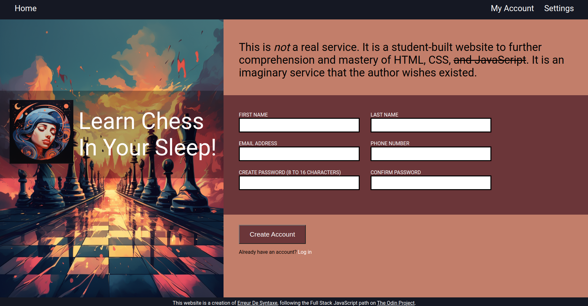

# TOP Sign Up Form
A sign-up form (for an imaginary service)

# Preview

    

# Links

-[Assignment Page (Dec '23)](https://www.theodinproject.com/lessons/node-path-intermediate-html-and-css-sign-up-form)

-[Finished Project](https://erreurdesyntaxe.github.io/sign-up-form/)

# Notable Features

-Validate input
-Style input through pseudo selectors
-Design a clean page that survives resizing

# Challenges

-Styling input fields: Chrome and Firefox apply their own style, and I was lucky
to come across the outline: none; that was not mentioned on TOP.

-Resizing the page: The large image on the left side does not resize correctly 
depending on the ratio of the viewport. I tried to tweak it to work, but I have
not succeeded yet.

# Lessons

-Form styling is hard. 
-There is a property called outline.
-There is a pseudo selector called input:user-invalid.
-Nested CSS is sometimes easier to write, read, and understand.

# Diary

-This is the first project of the Full Stack JavaScript course of The Odin
Project. Finally! 16 lessons' worth of readings and exercises have come to 
an end. 

-One aspect of the problem solving technique that I have neglected during other 
projects is the planning. But for this project, I have made a draft of the 
web page and thought of the challenges hidden within. Whenever my progress 
catches up to the plan, said plan will have to be revisited and expanded upon. 

-I often struggle with styling and the front end in general, but maybe that is
simply due to not having written much JS. Maybe if I do more back end projects
I will find it arduous as well. It's the desert of despair part of the 
programming student's journey.